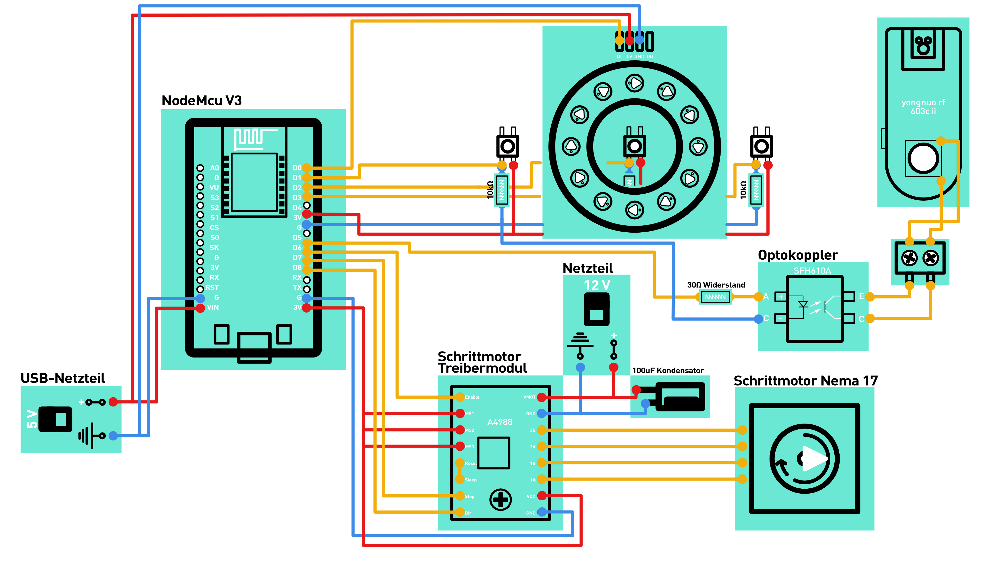
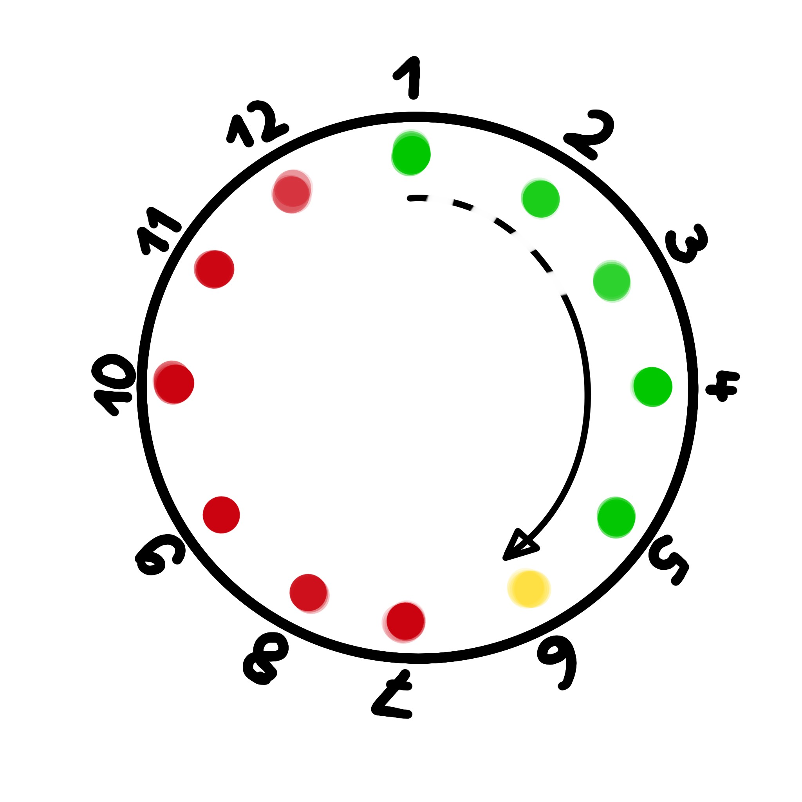
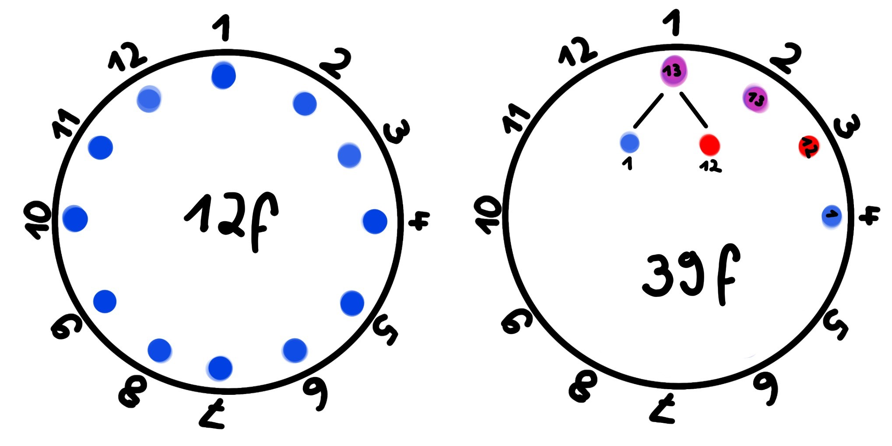

# Photogrammetrie-Drehteller
DIY 3D Scann, 360°, YONGNUO RF-603C II, RGB LED Ring WS2812B

## Elektronikteile

- NodeMcu V3
- RGB LED Ring WS2812B 12-Bit 50mm
- A4988 Schrittmotor Treibermodul

    └─ je 100uF Kondensator

- Twotrees Schrittmotor Nema 17 1.5A 17HS4401S 1.8°4
- Vishay Optokoppler Phototransistor SFH610A-1 DIP-4

    └─ je 30Ω Widerstand

- 3*Tastschalter

    └─ je 10kΩ Widerstand

- 12v 2A Netzteil

    └─ DC 5.5 mm X 2.1 mm Stecker und Buchse 
    
- USB Netzteil

    └─ USB -> 2.1 mm Kabel to 5.5 mm Buchse

> Alternativ Step Down Buck Converter 12v -> 5v

## Schaltung

## Anzeige

### Prozess/Ladebalken

### Einstellung 360°/Bild

Jeder Blauer Punkt steht für ein Bild sobalt man über 12 Bilder kommt gibt es Rote Punkte jeder Rote Punkt steht für 12 Bilder. Wen ein Roter und einer Blauer Punkt sich überlagern ensteht so ein Rosa Punkt.

## Teile

- Drehlager 360 Grad Drehteller kugelgelagert

## Hilfe

[arduino-a4988-nema17](https://starthardware.org/arduino-a4988-nema17/)